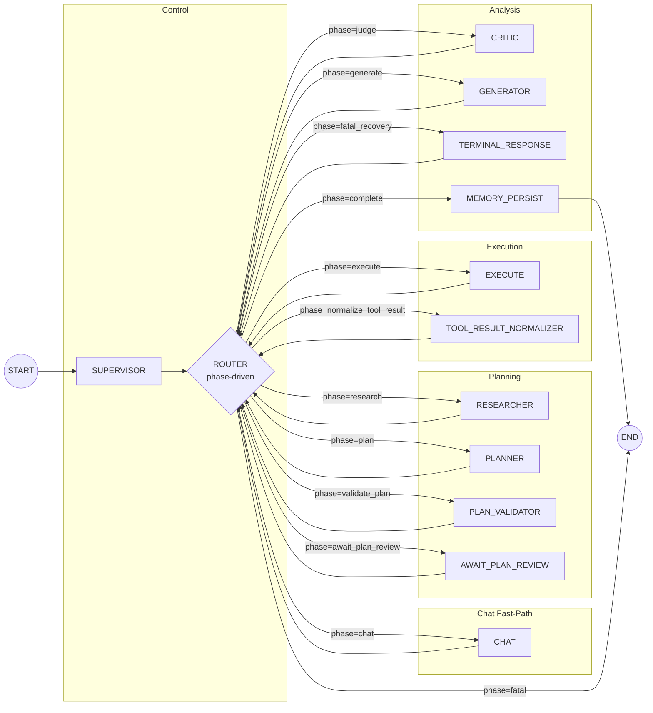

# nest-langgraph-ai [](https://github.com/matanbardugo/nest-langgraph-ai/actions/workflows/ci.yml)

A NestJS API that exposes an autonomous multi-agent AI workflow powered by LangGraph. Submit a natural-language prompt and the system autonomously plans, executes, and validates tasks using an LLM-backed agent loop and a rich toolset. Conversational prompts are handled via a fast-path chat mode; complex tasks go through the full planning pipeline.

**CI/CD:** GitHub Actions (build, test, coverage)

## Architecture

```
User Prompt
     |
     v
+-----------+
| SUPERVISOR|  Classifies intent → chat or agent; resolves pronouns via session memory
+-----+-----+
      |
      +-- chat ---------> CHAT -------> COMPLETE
      |
      v
+-----------+
| RESEARCHER|  Gathers project context (file tree, git status, vector recall)
+-----+-----+
      v
+-----------+
|  PLANNER  |  Creates multi-step execution plan (Zod JSON)
+-----+-----+
      v
+-----------+
| VALIDATOR |  Validates tools + params (Zod); optional human review pause
+-----+-----+
      |
      +-- REQUIRE_PLAN_REVIEW=true --> AWAIT_PLAN_REVIEW (human approve/reject/replan)
      |
      v
+-----------+
|  EXECUTOR |  Runs tool for the current step
+-----+-----+
      v
+-----------+
|NORMALIZER |  Wraps raw tool output into ToolResult envelope
+-----+-----+
      v
+-----------+
|   CRITIC  |  Decides advance / retry_step / replan / complete / fatal (Zod JSON)
+-----+-----+
      v
+-----------+
|   ROUTER  |  Phase-driven routing + hard stop limits (deadlock-proof)
+-----+-----+
      |
      +-- complete --> GENERATOR --> COMPLETE
      |
      +-- fatal    --> TERMINAL_RESPONSE --> COMPLETE
```



## Tech Stack

- **NestJS 11** — HTTP framework, DI, Swagger, throttling
- **LangGraph 1.2** — StateGraph for agent orchestration + Redis checkpoint saver
- **LangChain 1.x** — Tool abstractions and integrations
- **Mistral LLM** — Chat completion provider (`invokeLlm()`)
- **Tavily** — Web search API
- **Redis** — Session checkpoints + response caching
- **Qdrant** — Vector DB for semantic memory (cross-turn recall)
- **@xenova/transformers** — Free on-device embeddings (384-dim, all-MiniLM-L6-v2)
- **Zod 4** — Runtime schema validation for all LLM outputs
- **TypeScript 5.7** / **Jest 30**

## Available Tools

### File Operations (sandbox-enforced via `sandboxPath`)

| Tool | Description |
|------|-------------|
| `read_file` | Read a local file (100 KB limit) |
| `write_file` | Write/create a file (creates parent dirs) |
| `list_dir` | List directory contents |
| `tree_dir` | Recursive directory tree (ignores node_modules/git/dist) |
| `glob_files` | Bounded recursive file listing with extension filter |
| `read_files_batch` | Read multiple files in one call (bounded) |
| `stat_path` | File metadata: exists / type / size / mtime |
| `file_patch` | Find-and-replace within a file |
| `grep_search` | Regex pattern search across files |
| `ast_parse` | Semantic JS/TS parsing into chunks (for code analysis) |

### Intelligence & Search

| Tool | Description |
|------|-------------|
| `search` | Web search via Tavily |
| `llm_summarize` | AI-powered analysis of long content |
| `vector_upsert` | Embed text and store in Qdrant for semantic memory |
| `vector_search` | Embed query and search Qdrant for semantic recall |

### Diagrams

| Tool | Description |
|------|-------------|
| `generate_mermaid` | Generate a Mermaid `.mmd` diagram file |
| `read_mermaid` | Read an existing `.mmd` file |
| `edit_mermaid` | Edit an existing `.mmd` file with an instruction |

### HTTP

| Tool | Description |
|------|-------------|
| `http_get` | HTTP GET with SSRF protection and host allowlist |
| `http_post` | HTTP POST with SSRF protection and host allowlist |

### Git

| Tool | Description |
|------|-------------|
| `git_info` | Whitelisted git commands: status, log, diff, branch, show |

### System

| Tool | Description |
|------|-------------|
| `system_info` | Hostname, platform, memory, uptime |

### Tool Usage Tips

**Accurate diagrams:** `ast_parse` the source → `generate_mermaid` with `source="__PREVIOUS_RESULT__"` to prevent hallucinated nodes/edges.

**Vector memory:** `vector_search` early in planning to recall prior knowledge; `vector_upsert` after successful steps to persist facts.

## Quick Start

```bash
# 1. Install
npm install --legacy-peer-deps

# 2. Configure
cp .env.example .env
# Edit .env: set MISTRAL_API_KEY and TAVILY_API_KEY

# 3. Start infrastructure (Redis + Qdrant)
npm run docker:up

# 4. Start the app
npm run start:dev

# API:     http://localhost:3000/api
# Swagger: http://localhost:3000/docs  (requires ENABLE_SWAGGER=true)
```

## API

**Base URL:** `http://localhost:3000/api`
**Swagger UI:** `http://localhost:3000/docs` (set `ENABLE_SWAGGER=true`)

### `POST /agents/run` — Synchronous run

```bash
curl -X POST http://localhost:3000/api/agents/run \
  -H 'Content-Type: application/json' \
  -d '{"prompt": "List all TypeScript files in src", "sessionId": "my-session"}'
```

Response: `{ "result": "...", "sessionId": "..." }`

### `POST /agents/stream` — SSE streaming run

```bash
curl -N -X POST http://localhost:3000/api/agents/stream \
  -H 'Content-Type: application/json' \
  -d '{"prompt": "List all TypeScript files in src", "sessionId": "my-session"}'
```

SSE event types: `status` | `plan` | `tool_call_started` | `tool_call_finished` | `llm_token` | `review_required` | `final` | `error`

### `DELETE /agents/session/:sessionId` — Delete session

```bash
curl -X DELETE http://localhost:3000/api/agents/session/my-session
```

### Plan Review (requires `REQUIRE_PLAN_REVIEW=true`)

| Endpoint | Method | Description |
|----------|--------|-------------|
| `/agents/review/:sessionId` | GET | Human review HTML page |
| `/agents/session/:sessionId/review-data` | GET | Review data as JSON |
| `/agents/session/:sessionId/approve` | POST | Approve plan → resume execution |
| `/agents/session/:sessionId/reject` | POST | Reject plan → stop run |
| `/agents/session/:sessionId/replan` | POST | Reject plan → trigger re-plan |

### Health & Metrics

```bash
curl http://localhost:3000/health             # Full status
curl http://localhost:3000/health/live        # Liveness probe
curl http://localhost:3000/health/ready       # Readiness probe
curl http://localhost:3000/health/dependencies # Dependency diagnostics
curl http://localhost:3000/metrics            # Prometheus metrics
```

## Environment Variables

| Variable | Required | Default | Description |
|----------|----------|---------|-------------|
| `MISTRAL_API_KEY` | Yes | — | Mistral API key |
| `TAVILY_API_KEY` | Yes | — | Tavily search API key |
| `REDIS_HOST` | Yes | — | Redis hostname |
| `REDIS_PORT` | Yes | — | Redis port |
| `PORT` | No | `3000` | HTTP server port |
| `MISTRAL_MODEL` | No | `mistral-small-latest` | LLM model name |
| `MISTRAL_TIMEOUT_MS` | No | `30000` | LLM call timeout (ms) |
| `CORS_ORIGIN` | No | `*` | Allowed CORS origin |
| `AGENT_MAX_ITERATIONS` | No | `3` | Base recovery-cycle limit (derives tool-call caps) |
| `AGENT_MAX_RETRIES` | No | `3` | Max step retry attempts before replan |
| `AGENT_MAX_RETBACKS` | No | `3` | Max replan cycles before fatal |
| `TOOL_TIMEOUT_MS` | No | `15000` | Per-tool invocation timeout (ms) |
| `CACHE_TTL_SECONDS` | No | `60` | Redis cache TTL for agent responses |
| `SESSION_TTL_SECONDS` | No | `86400` | Redis session TTL (24 h) |
| `CRITIC_RESULT_MAX_CHARS` | No | `8000` | Max chars passed to critic from tool output |
| `PROMPT_MAX_ATTEMPTS` | No | `5` | Max recent attempts included in prompts |
| `PROMPT_MAX_SUMMARY_CHARS` | No | `2000` | Max chars for session memory in prompts |
| `AGENT_WORKING_DIR` | No | `process.cwd()` | Sandbox root for file tools |
| `QDRANT_URL` | No | `http://localhost:6333` | Qdrant URL |
| `QDRANT_COLLECTION` | No | `agent_vectors` | Qdrant collection name |
| `QDRANT_VECTOR_SIZE` | No | `384` | Embedding dimensions (must match model) |
| `QDRANT_CHECK_COMPATIBILITY` | No | `false` | Qdrant version compatibility checks |
| `HEALTH_EXTERNAL_CHECK_TIMEOUT_MS` | No | `2000` | External dependency health timeout |
| `HEALTH_EXTERNAL_CACHE_TTL_MS` | No | `60000` | Dependency diagnostics cache TTL |
| `AGENT_MAX_RETBACKS` | No | `3` | Max replan cycles before fatal (1-10) |
| `REQUIRE_PLAN_REVIEW` | No | `false` | Pause for human plan approval before execution |
| `ENABLE_SWAGGER` | No | `false` | Enable Swagger UI at `/docs` |
| `NODE_ENV` | No | `development` | Node environment |
| `API_KEY` | No | `""` | API key for auth (`Authorization: Bearer` or `x-api-key`). Empty = disabled |
| `LOG_FORMAT` | No | `text` | Log format: `text` or `json` (use `json` for production) |

See [docs/ENV.md](docs/ENV.md) for the full annotated reference.

## Development

```bash
npm run build          # Production build
npm run start:dev      # Dev server with watch
npm run lint           # ESLint with auto-fix
npm run format         # Prettier format
npm run test           # Unit tests
npm run test:cov       # Coverage report
npm run test:e2e       # End-to-end tests

# Docker helpers
npm run docker:up          # Start Redis + Qdrant
npm run docker:up:tools    # Start with Redis Commander
npm run docker:down        # Stop containers
npm run docker:clean       # Remove containers + volumes + images
npm run docker:fresh       # Clean + rebuild
```

## Adding a New Tool

1. Create `src/modules/agents/tools/<name>.tool.ts` — define a Zod input schema and export a `ToolDefinition`
2. Register it in `src/modules/agents/tools/tool.catalog.ts`
3. The tool is automatically available to the planner and executor

See [docs/TOOLS.md](docs/TOOLS.md) for the full tool registry reference.

## License

MIT
