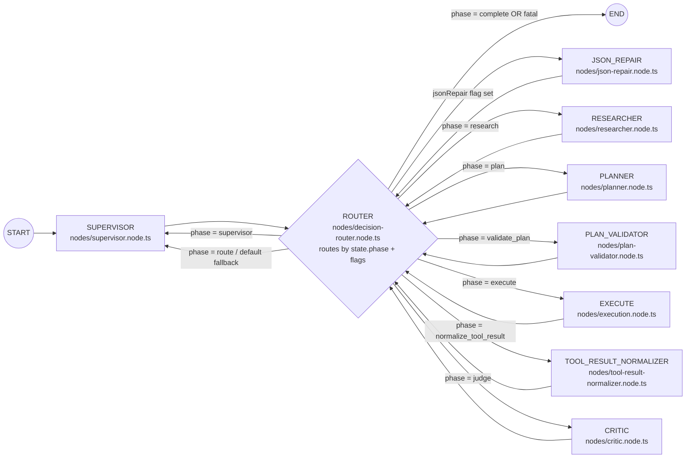

# nest-langgraph-ai [](https://github.com/matanbardugo/nest-langgraph-ai/actions/workflows/ci.yml)

A NestJS API that exposes an autonomous multi-agent AI workflow powered by LangGraph. Submit a natural-language prompt and the system autonomously plans, executes, and validates tasks using an LLM-backed agent loop and a rich toolset.

**CI/CD:** GitHub Actions (build, test, coverage)

## Architecture

```
User Prompt
     |
     v
+-----------+
| SUPERVISOR |  Normalizes objective / feasibility (Zod JSON)
+-----+-----+
      v
+-----------+
| RESEARCHER |  Gathers project context (file tree, git status)
+-----+-----+
      v
+-----------+
|  PLANNER   |  Creates multi-step execution plan (Zod JSON)
+-----+-----+
      v
+-----------+
| PLAN_VALID |  Validates tools + params (Zod)
+-----+-----+
      v
+-----------+
|  EXECUTOR  |  Runs tools step-by-step
+-----+-----+
      v
+-----------+
| NORMALIZER|  Wraps raw tool output into ToolResult envelope
+-----+-----+
      v
+-----------+
|   CRITIC  |  Decides advance/retry/replan/complete/fatal (Zod JSON)
+-----+-----+
      v
+-----------+
|  ROUTER   |  Phase-driven routing + hard stop limits (deadlock-proof)
+-----------+
```



## Tech Stack

- **NestJS 11** - HTTP framework, DI, Swagger
- **LangGraph 1.2** - StateGraph for agent orchestration
- **LangChain 1.x** - Tool abstractions and integrations
- **Mistral LLM** - Chat completion provider
- **Tavily** - Web search API
- **Redis** - Response caching
- **Qdrant** - Vector DB (semantic memory)
- **Local embeddings** - Free on-device embeddings via `@xenova/transformers`
- **TypeScript 5.7** / **Jest 30**

## Available Tools

| Tool | Description |
|------|-------------|
| `search` | Web search via Tavily |
| `read_file` | Read a local file |
| `write_file` | Write/create a file |
| `list_dir` | List directory contents |
| `tree_dir` | Recursive directory tree |
| `llm_summarize` | AI-powered content analysis |
| `git_info` | Git status, log, diff, branches |
| `grep_search` | Pattern search across files |
| `file_patch` | Find/replace within a file |
| `generate_mermaid` | Generate a Mermaid `.mmd` diagram file (optionally grounded in source text) |
| `read_mermaid` | Read a Mermaid `.mmd` diagram file |
| `edit_mermaid` | Edit an existing Mermaid `.mmd` diagram file |
| `glob_files` | Safe recursive file listing (extension filter, bounded) |
| `read_files_batch` | Read multiple files in one call (bounded) |
| `stat_path` | File metadata (exists/type/size/mtime) |
| `vector_upsert` | Embed text locally and upsert into Qdrant for semantic memory |
| `vector_search` | Embed query locally and search Qdrant for semantic recall |

### Diagrams (recommended)

For diagrams that must match real code/graph structure, prefer:

1) `ast_parse` the source file  
2) `generate_mermaid` with `source="__PREVIOUS_RESULT__"` to prevent hallucinated edges/nodes

### Vector memory (recommended)

When you want the agent to “remember” or “recall” information across turns:

- **Recall first**: use `vector_search` early when planning depends on prior knowledge.
- **Store after success**: use `vector_upsert` for durable facts, decisions, or summaries after a step completes successfully.
- **Vector size must match**: `QDRANT_VECTOR_SIZE` must match the embedding model dimension (default in this repo is **384**).

## Quick Start

```bash
# 1. Install
npm install --legacy-peer-deps

# 2. Configure
cp .env.example .env
# Edit .env with your MISTRAL_API_KEY, TAVILY_API_KEY, REDIS_HOST, REDIS_PORT

# 3. Start Redis
docker compose -f docker/docker-compose.yml up -d

# 4. Run
npm run start:dev
```

## API

**Base URL:** `http://localhost:3000/api`
**Swagger:** `http://localhost:3000/docs`

### POST `/agents/run`

```bash
curl -X POST http://localhost:3000/api/agents/run \
  -H 'Content-Type: application/json' \
  -d '{"prompt": "List all TypeScript files in the src directory"}'
```

### GET `/health`

```bash
curl http://localhost:3000/api/health
```

## Environment Variables

| Variable | Required | Default | Description |
|----------|----------|---------|-------------|
| `MISTRAL_API_KEY` | Yes | - | Mistral API key |
| `TAVILY_API_KEY` | Yes | - | Tavily search API key |
| `REDIS_HOST` | Yes | - | Redis hostname |
| `REDIS_PORT` | Yes | - | Redis port |
| `PORT` | No | `3000` | HTTP server port |
| `MISTRAL_MODEL` | No | `mistral-small-latest` | LLM model |
| `MISTRAL_TIMEOUT_MS` | No | `30000` | LLM call timeout (ms) |
| `CORS_ORIGIN` | No | `*` | Allowed CORS origin |
| `AGENT_MAX_ITERATIONS` | No | `3` | Max iterations (legacy; router also enforces hard stop limits) |
| `TOOL_TIMEOUT_MS` | No | `15000` | Per-tool invocation timeout (ms) |
| `CACHE_TTL_SECONDS` | No | `60` | Redis cache TTL for agent responses |
| `CRITIC_RESULT_MAX_CHARS` | No | `8000` | Max chars passed to critic from tool output |
| `PROMPT_MAX_ATTEMPTS` | No | `5` | Max recent attempts included in supervisor/planner prompts |
| `PROMPT_MAX_SUMMARY_CHARS` | No | `2000` | Max chars passed into `llm_summarize` tool |
| `AGENT_WORKING_DIR` | No | `process.cwd()` | Sandbox root for file tools |
| `QDRANT_URL` | No | `http://localhost:6333` | Qdrant URL |
| `QDRANT_COLLECTION` | No | `agent_vectors` | Qdrant collection name |
| `QDRANT_VECTOR_SIZE` | No | `384` | Embedding vector dimensions (matches free local embeddings) |

See [CLAUDE.md](CLAUDE.md) for the full variable reference.

## Development

```bash
npm run build          # Production build
npm run lint           # ESLint with auto-fix
npm run format         # Prettier
npm run test           # Unit tests
npm run test:cov       # Coverage report
npm run test:e2e       # End-to-end tests
```

## Adding a New Tool

1. Create `src/modules/agents/tools/<name>.tool.ts`
2. Define Zod input schema
3. Register in `src/modules/agents/tools/index.ts`

## License

MIT
